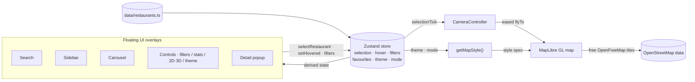

<div align="center">

# 🍁 Chen's Toronto Eats

**A personal, interactive 3D map of the restaurants I've actually eaten at across downtown Toronto.**

Not a finder. Not a directory. My own hand‑curated map — click a glowing pin to read my review, then wander the city in 3D or flip to a flat 2D street map.

<br/>


<br/>

[Overview](#overview) · [Features](#features) · [Tech Stack](#tech-stack) · [Architecture](#architecture) · [Getting Started](#getting-started) · [Make It Your Own](#make-it-your-own) · [Roadmap](#roadmap)

</div>

---

## Overview

**Chen's Toronto Eats** is a premium, single‑page map experience built to feel like the best parts of
**Apple Maps**, **Mapbox**, **Notion**, and **Airbnb** — a full‑bleed, stylized 3D city rendered with
extruded buildings, floating glassmorphic UI, and cinematic camera animations.

It is deliberately **not** a generic restaurant finder. Every glowing marker is a place I have visited;
tapping one opens my own review, rating, visit date, and notes. The map is a living, personal food diary
of downtown Toronto.

The entire experience runs on **free, key‑less, open‑source map tiles** — no Google Maps, no Mapbox
account, no API keys, and no usage costs.

> **Why it exists:** a portfolio‑grade demonstration of a modern, production‑quality Next.js app —
> strict typing, thoughtful state management, accessible and responsive UI, and a genuinely delightful
> map interaction — wrapped around something personal.

---

## Features

### 🗺️ The map

- **Immersive 3D basemap** — extruded buildings with height‑based shading and a subtle atmospheric sky,
  rendered from OpenStreetMap vector data.
- **2D / 3D toggle** — flip between a pitched 3D city and a flat, Google‑Maps‑style 2D street map
  (footprint buildings, top‑down, rotation locked). Both are generated from the same free tiles; the
  camera animates smoothly between them.
- **Progressive skyline** — when zoomed out, only major (tall) buildings render, so the city reads as a
  recognizable skyline instead of a carpet of boxes; mid‑ and low‑rise fill in as you zoom in.
- **Cinematic camera** — selecting a place performs an eased ~1 s fly‑to. It never jumps, and re‑selecting
  the same place always re‑centers.

### 🍽️ The food diary

- **Custom floating markers** — bespoke pins that float, pulse, glow and scale on hover (never default map pins).
- **Glassmorphic detail popup** — a blurred, rounded card (a bottom sheet on mobile) with the photo, my
  review link, description, rating, visit date, and tags.
- **Three ways to browse** — a top‑center **search** with full keyboard navigation, a collapsible
  **sidebar** of every place, and a hoverable bottom **carousel**.
- **About panel** — a tap on the logo explains whose map this is and what it's for.

### 🎛️ Power tools

- **Filters** — by cuisine and tag, plus a favourites‑only view.
- **Favourites** — starred places, persisted locally.
- **Statistics** — total visited, average rating, distinct cuisines, and a top‑cuisines breakdown.
- **Add / edit / delete places** in the app — set a location by clicking the map, validated with Zod,
  and persisted locally so changes survive a reload.
- **Dark / light theme** — dark by default, with a smooth toggle (persisted, no flash on load).

### ♿ Built right

- **Responsive** — desktop‑first, with graceful tablet and mobile layouts (drawers and bottom sheets).
- **Accessible** — keyboard navigation, visible focus rings, ARIA labelling, and Escape‑to‑close everywhere.
- **Performant** — lazy‑loaded map, memoized selectors, diffed markers, and minimized re‑renders.

---

## Screenshots

> Capture the views below into `docs/screenshots/` and embed them here.

|           3D · Dark (default)           | 2D · Light (Google‑Maps style) |     Restaurant popup     |        Mobile         |
| :-------------------------------------: | :----------------------------: | :----------------------: | :-------------------: |
| Pitched skyline with extruded buildings |    Flat top‑down street map    | Glassmorphic review card | Drawer + bottom sheet |

<!--
<p align="center">
  
  
</p>
-->

---

## Tech Stack

| Area            | Choice                                                                                                                      |
| --------------- | --------------------------------------------------------------------------------------------------------------------------- |
| Framework       | [Next.js 15](https://nextjs.org/) (App Router) · [React 19](https://react.dev/)                                             |
| Language        | [TypeScript](https://www.typescriptlang.org/) — `strict`, zero `any`                                                        |
| Mapping         | [MapLibre GL JS](https://maplibre.org/) + free [OpenFreeMap](https://openfreemap.org/) vector tiles (3D building extrusion) |
| Styling         | [Tailwind CSS](https://tailwindcss.com/) · [shadcn/ui](https://ui.shadcn.com/) · [Radix UI](https://www.radix-ui.com/)      |
| State           | [Zustand](https://zustand-demo.pmnd.rs/) (with `persist`)                                                                   |
| Animation       | [Framer Motion](https://www.framer.com/motion/)                                                                             |
| Validation      | [Zod](https://zod.dev/)                                                                                                     |
| Icons           | [Lucide](https://lucide.dev/)                                                                                               |
| Tooling         | [ESLint](https://eslint.org/) · [Prettier](https://prettier.io/)                                                            |
| Package manager | [npm](https://www.npmjs.com/)                                                                                               |
| Deployment      | [Vercel](https://vercel.com/)                                                                                               |

---

## Architecture

A single immersive client experience: a full‑bleed map with independent, self‑positioning overlays
floating above it. A typed Zustand store is the single source of truth; the map camera is decoupled
from the UI so every surface stays in sync.



**Key decisions**

- **Single source of truth.** Selection, hover, filters, favourites, theme, and 2D/3D mode all live in
  one Zustand slice, so markers, sidebar, search, carousel, and popup can never disagree.
- **Decoupled camera.** Any surface focuses a place by calling `selectRestaurant(id)`. A dedicated
  `CameraController` watches the selection and performs the eased fly‑to — no component drives the camera
  directly. A monotonic `selectionTick` guarantees re‑selecting the same place re‑centers.
- **Imperative markers, declarative UI.** Markers are managed via the MapLibre API and diffed by id for
  smooth panning; everything else is declarative React + Framer Motion.
- **Style as data.** `getMapStyle(theme, mode)` returns one of four cached MapLibre style specs
  (dark/light × 2D/3D). 3D uses height‑tiered `fill-extrusion` layers; 2D swaps in flat footprint fills.
- **Resilient by design.** Photos fall back to deterministic gradients; imported JSON is validated with
  Zod before it can touch state.

---

## Project Structure

```
app/                      # Next.js App Router
  layout.tsx              # Root layout, fonts, metadata, theme bootstrap
  page.tsx                # Composes the map + floating overlays
  icon.svg                # Favicon
components/
  map/                    # MapView, RestaurantMarker (layer), CameraController
  restaurant/             # RestaurantPopup, cards, RatingStars, RestaurantImage
  sidebar/                # Sidebar, SidebarItem, SidebarToggle
  search/                 # SearchBar (keyboard-navigable combobox)
  controls/               # Filters, stats, import/export, 2D-3D & theme toggles
  layout/                 # Brand + About dialog, TopBar
  providers/              # ThemeProvider
  ui/                     # shadcn/ui primitives
data/restaurants.ts       # The curated list + derived cuisines/tags
hooks/                    # useFilteredRestaurants, useFlyTo, useMediaQuery, useEscapeKey
lib/                      # utils, constants, mapStyle (the 2D/3D dark/light styles)
store/useAppStore.ts      # Zustand store (+ persist)
styles/globals.css        # Design tokens, glass utilities, MapLibre overrides
types/                    # Restaurant type + Zod schemas
```

---

## Getting Started

### Prerequisites

- **Node.js 18.18+** (Node 20 LTS recommended)
- **npm 9+**

No environment variables or API keys are required — the map tiles are free and key‑less.

### Installation

```bash
git clone https://github.com/YheChen/RestarauntBlog.git
cd RestarauntBlog
npm install
```

### Run

```bash
npm run dev        # start the dev server → http://localhost:3000
```

### Scripts

| Script                 | Description                          |
| ---------------------- | ------------------------------------ |
| `npm run dev`          | Start the development server         |
| `npm run build`        | Create an optimized production build |
| `npm run start`        | Serve the production build           |
| `npm run lint`         | Run ESLint                           |
| `npm run format`       | Format the codebase with Prettier    |
| `npm run format:check` | Check formatting without writing     |
| `npm run typecheck`    | Type-check without emitting          |
| `npm run photos`       | Download stock photos into `public/` |

---

## Photos

Every restaurant card shows an image, from one of three sources, tried in this order:

1. **A real photo of the place** on the restaurant record (`image` / `images`). Five of the 74 use
   freely-licensed Wikimedia Commons shots of the actual storefronts.
2. **A photo of the dish the place is known for**, from
   [`data/dish-photos.ts`](data/dish-photos.ts). Each restaurant is mapped to a dish drawn from its own
   review text — Bun Saigon gets pho, Mother's Dumplings gets dumplings, Tim Hortons gets coffee and
   donuts, the Blue Chip truck gets poutine. The other 69 places resolve at this level.
3. **A cuisine photo** from [`data/cuisine-photos.ts`](data/cuisine-photos.ts), then a generic one.
   Nothing currently falls this far; they exist so a newly added place still gets something sensible
   before anyone writes a dish mapping for it.

Within a set, the photo is chosen by hashing the restaurant id, so a given place always gets the same
image and adjacent cards do not repeat — 49 distinct photos across the 69. Anything from levels 2 or 3
is badged **Stock photo** in the detail popup, because it is not the restaurant itself. Whatever the
source, the photo credit and licence are shown beneath it.

The resolution logic lives in [`lib/restaurant-images.ts`](lib/restaurant-images.ts), so the UI never
has to handle a missing image.

### Self-hosting the stock photos

```bash
npm run photos
```

Downloads roughly 120 Unsplash photos into `public/photos/cuisine/` and writes
`data/cuisine-photos-local.json`. That manifest is the only thing deciding local versus remote: with it
the site serves the photos itself, without it they load from Unsplash, so a fresh clone works with no
setup. Delete it to go back to hotlinking. No API key or account is needed; the
[Unsplash Licence](https://unsplash.com/license) permits redistributing the photos as part of your own
work.

Adding a real photo for a place is just a matter of setting `image` and `imageCredit` on its record in
[`data/restaurants.ts`](data/restaurants.ts). It will immediately outrank the stock one.

---

## The Map — open source, zero cost

The basemap is rendered by **MapLibre GL JS** over **OpenFreeMap** vector tiles, which serve the full
planet of OpenStreetMap data for free with **no API key and no signup**. Map "quality" here is driven by
the _style_, not the tile source, so the app ships four hand‑tuned styles (dark/light × 2D/3D) defined in
[`lib/mapStyle.ts`](lib/mapStyle.ts):

- **3D** — pitched camera with height‑tiered building extrusion, road hierarchy, labels, and an
  atmospheric sky.
- **2D** — a flat, top‑down, Google‑Maps‑style street map with footprint buildings and rotation locked
  (mouse, touch, and keyboard).

Because there are no metered API calls, the map is free to run at any scale.

---

## Make It Your Own

The restaurant list is the single source of truth in
[`data/restaurants.ts`](data/restaurants.ts). Add, edit, or remove entries there — the search, filters,
sidebar, carousel, markers, and statistics all update automatically.

```ts
{
  id: 'my-restaurant',            // required · unique, kebab-case
  name: 'My Restaurant',          // required
  latitude: 43.6481,              // required
  longitude: -79.3962,            // required · negative in Toronto
  reviewUrl: 'https://…',         // required · a valid URL
  cuisine: 'Italian',             // required · drives the carousel + cuisine filter
  description: 'My review…',      // required
  rating: 4.7,                    // optional · 0–5 (half-stars supported)
  visitDate: '2024-06-02',        // optional · ISO date → "Visited June 2024"
  tags: ['pasta', 'date night'],  // optional · become tag filters
  priceRange: '$$$',              // optional · '$' | '$$' | '$$$' | '$$$$'
  neighbourhood: 'King West',     // optional
  image: 'https://…jpg',          // optional · falls back to a gradient tile
}
```

Prefer no code? Use the **＋ Add** button in the app — it has the same fields, sets the location by
letting you click the map, and saves to your browser. See the type definition in
[`types/restaurant.ts`](types/restaurant.ts).

> **Importing from Google Maps.** The list in `data/restaurants.ts` is generated from a
> [Google Takeout](https://takeout.google.com) export (**Maps (your places)** → `Reviews.json`) by
> [`scripts/import-google-takeout.mjs`](scripts/import-google-takeout.mjs). Re‑run it any time to pull
> in new reviews:
>
> ```bash
> node scripts/import-google-takeout.mjs "/path/to/Reviews.json"
> ```
>
> It keeps Toronto food & drink places, maps star ratings, review text, prices, and meal‑type tags,
> and derives cuisine and neighbourhood. After regenerating, bump `SEED_VERSION` in
> [`store/useAppStore.ts`](store/useAppStore.ts) so browsers holding an older copy pick up the new data.

---

## Accessibility

- Full keyboard navigation, including an ARIA combobox pattern for search.
- Visible focus rings on every interactive element.
- ARIA labels on all icon‑only buttons; `Escape` closes every overlay.
- Respects reduced‑motion preferences via the animation layer.

## Performance

- The MapLibre map is lazy‑loaded (`next/dynamic`, client‑only) behind a graceful loading state.
- Filtering is a single memoized selector; markers are diffed by id rather than rebuilt.
- Store subscriptions are sliced to avoid unnecessary re‑renders.
- Production build is fully static; first‑load JS is ~214 kB.

## Quality & Tooling

The project is strict end‑to‑end and clean on every gate:

```bash
npx tsc --noEmit   # no type errors (strict, no `any`)
npm run lint       # no ESLint errors
npm run build      # production build succeeds
```

---

## Deployment

Deploys to **Vercel** with zero configuration:

1. Push to GitHub.
2. Import the repo at [vercel.com/new](https://vercel.com/new).
3. Accept the detected **Next.js** defaults and deploy.

No environment variables are required. Any host that supports Next.js works too.

---

## Roadmap

- [ ] Marker clustering at low zoom for dense areas
- [ ] Shareable deep links (`?place=alo`) that open a restaurant on load
- [ ] "Near me" via the browser geolocation API
- [ ] MDX‑backed long‑form reviews with photo galleries
- [ ] PWA / offline support and installability

---

## Contributing

This is a personal project, but issues and pull requests are welcome. To propose a change:

1. Fork the repository and create a feature branch (`git checkout -b feat/my-change`).
2. Make your change and ensure `npm run lint` and `npm run build` both pass.
3. Open a pull request describing the change and the motivation.

---

## License

Released under the [MIT License](LICENSE) © Yanzhen Chen.

## Acknowledgements

- [OpenFreeMap](https://openfreemap.org/) and [OpenStreetMap](https://www.openstreetmap.org/) contributors for free, open map data and tiles
- [MapLibre](https://maplibre.org/) for the open‑source GL renderer
- [shadcn/ui](https://ui.shadcn.com/) and [Radix UI](https://www.radix-ui.com/) for accessible UI primitives

## Author

**Yanzhen Chen** — built with a lot of good meals. 🧡

<div align="center"><sub>Toronto · downtown, one bite at a time</sub></div>
